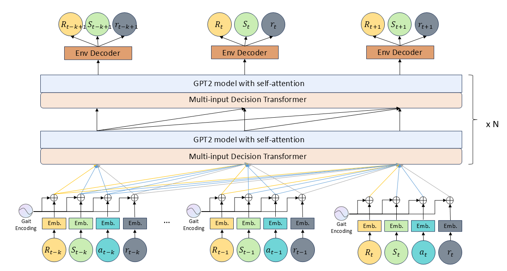
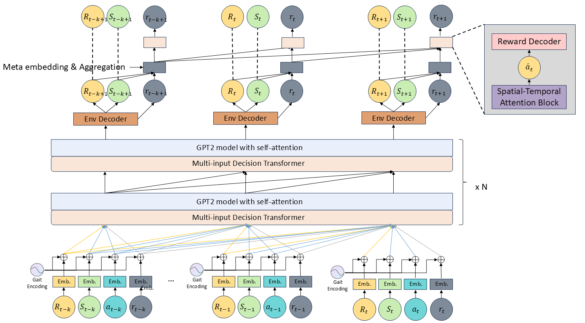
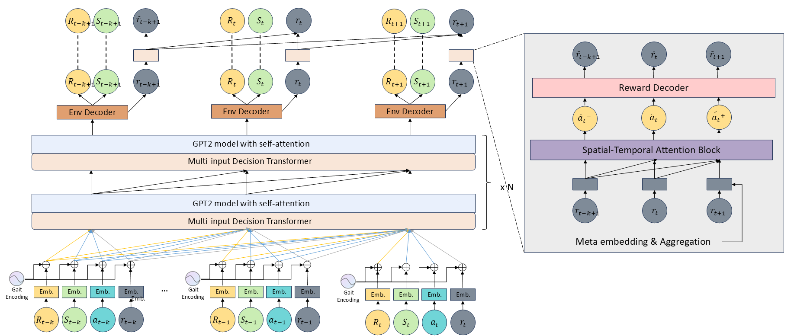
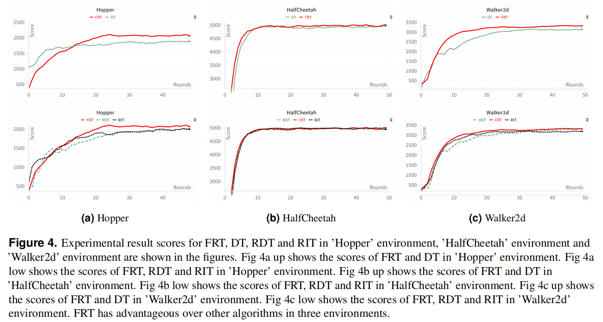
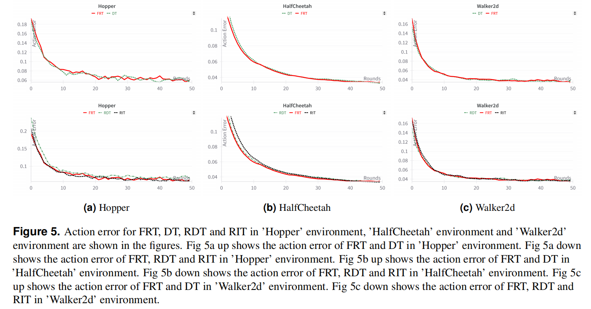
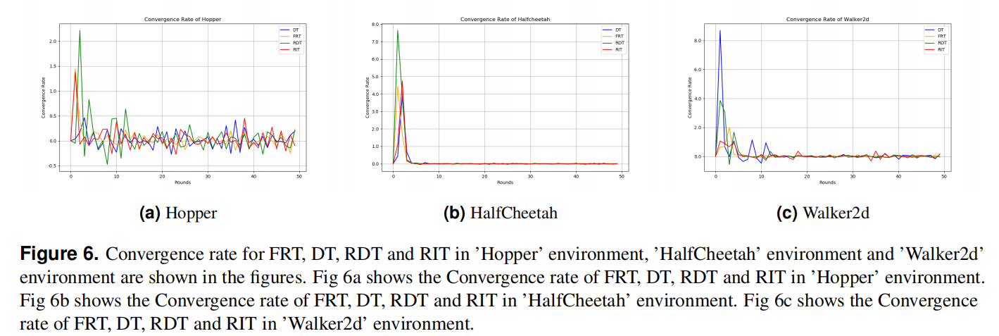
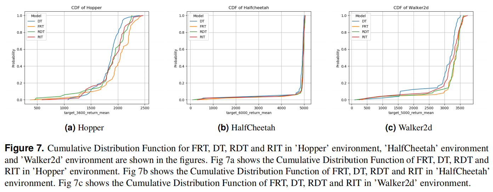
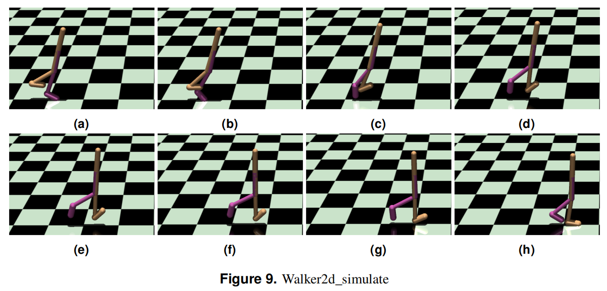
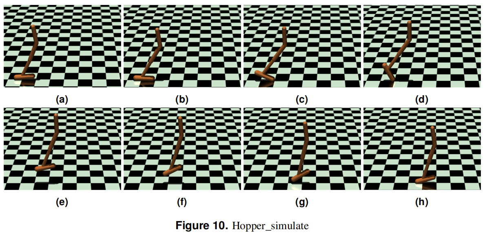
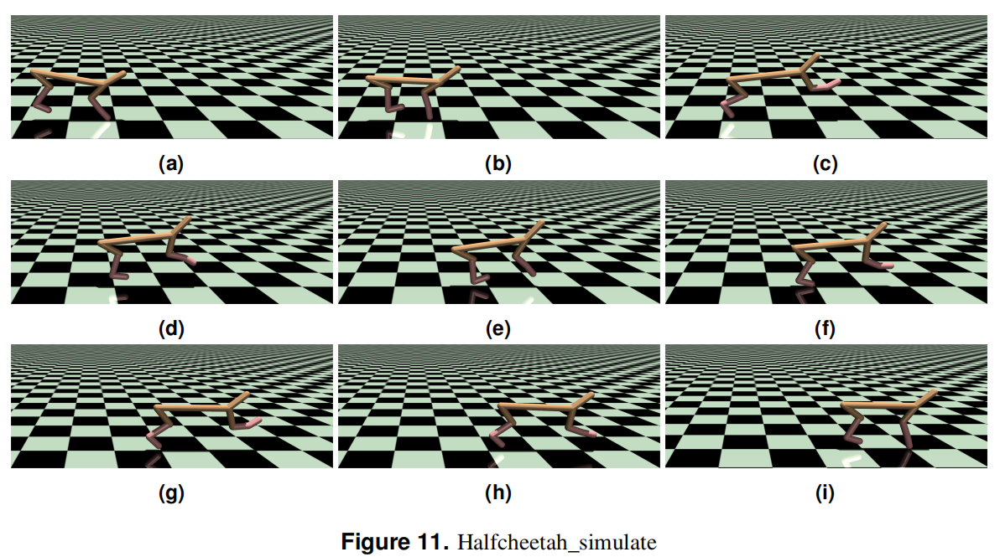

# Robot Motion Skill Learning using Focused Reward Transformer (FRT)

## Overview
This repository provides an implementation of **Focused Reward Transformer (FRT)**, an advanced model for robot motion skill learning. The FRT improves upon Decision Transformers (DT) by integrating immediate reward mechanisms, optimizing motion control through a balanced approach between long-term planning and real-time adaptation.

### Key Features:
- Introduces **Reward-Integrated Transformer (RIT)** and **Reward-Driven Transformer (RDT)** as intermediate models.
- Implements **Focused Reward Transformer (FRT)**, selectively integrating reward-specific sequences for enhanced learning.
- Conducts evaluations using **MuJoCo** environments: **Hopper, Walker2d, and HalfCheetah**.
- Compares FRT with **Decision Transformer (DT), RIT, and RDT** in simulated robotic control tasks.

## Installation
To set up the environment, install the required dependencies using:
```bash
pip install -r requirements.txt
```
Additionally, ensure MuJoCo is installed for running simulations.

## Model Architecture
The architecture consists of three key components:
1. **Reward-Integrated Transformer (RIT)**: Adds real-time reward sequences into input embeddings.


2. **Reward-Driven Transformer (RDT)**: Introduces a reward-specific attention block for improved reward learning.


3. **Focused Reward Transformer (FRT)**: Optimizes reward integration within the self-attention mechanism.


## Experiments and Results
The model was evaluated on three environments:
- **Hopper** (Jumping motion control)
- **Walker2d** (Bipedal walking control)
- **HalfCheetah** (Fast running motion)

### Performance Comparison:





## Usage
To train and test the model, run:
```bash
python train.py --env Hopper
python train.py --env Walker2d
python train.py --env HalfCheetah
```
Modify hyperparameters in `config.py` as needed.

## Visualization




- **Figures 9, 10, 11** show the motion of robots in different environments.
- Additional videos are available in the supplementary materials.

## Citation
If you use this work, please cite:
```
@article{FRT2024,
  author = {Borui Nan, Xinyi Zheng, Wanru Gong, Lanyue Bi, Xiaoyv Zhu, Xiaoqing Zhu},
  title = {Robot Motion Skill Learning Method based on Focused Reward Transformer (FRT)},
  journal = {arXiv preprint},
  year = {2024}
}
```

## License
This project is licensed under the MIT License.

